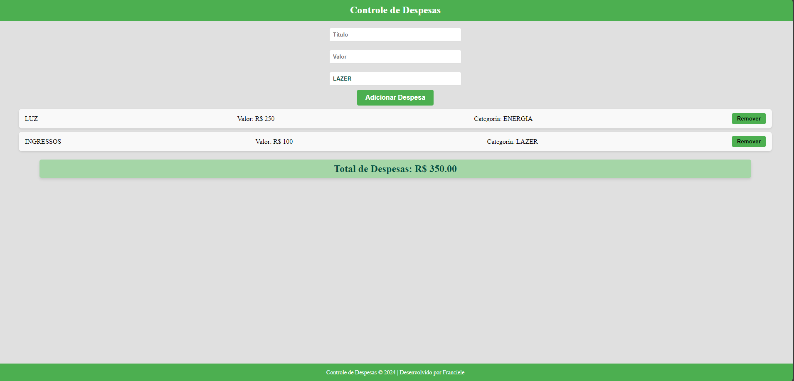

# Dump--control

Um aplicativo s para gerenciar e controlar suas despesas diárias. Com ele, você pode adicionar, visualizar e somar suas despesas, além de organizá-las de forma prática.

## Funcionalidades

- Adicionar novas despesas com descrição, valor,  e categoria.
- Exibir a lista de despesas adicionadas.
- Calcular o total de despesas.
- Remover despesas da lista.

## Tecnologias Utilizadas

- React: Biblioteca JavaScript para construção de interfaces de usuário.
- CSS: Para estilização da aplicação.
